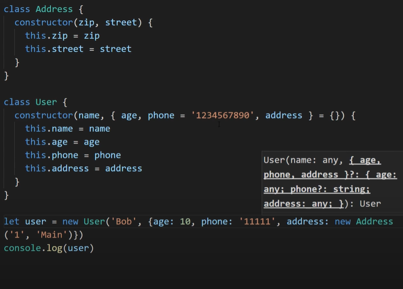
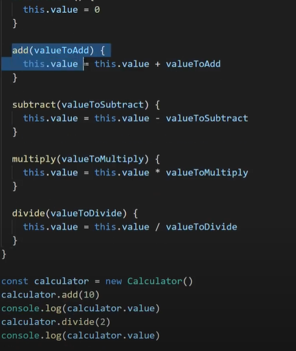

## Null design pattern:

### [code here](https://github.com/vinit-churi/Design-Patterns)

The scenarious in which this design pattern is preferred is
first need to talk about the scenarios one would want to use this pattern in so we can better understand why this pattern is being used and how it works essentially the null object pattern is going to be used anytime that you have a null object being returned so the keyword null in a programming language such as JavaScript being returned so normally when you do that you have to check if something is equal to null before you actually access the different properties on that no problem object because if you access a method for example on a no object you're going to get a null error being thrown in your code which is something you don't want so you need to have a bunch of if checks in your code to check to see if something's equal to null or not before you proceed to use the rest of the code the idea behind the null object pattern is that you create an object that you return instead of null that has the exact same signature so the same properties and the same methods as the object you would already be returning from that method and it'll just have default values for all these different properties and methods so now instead of having to check for null every single time and then if it's null do something in if it's not and we'll do something else you can just treat the object that's being returned from this method

---

## Builder pattern:

### [code here](https://github.com/vinit-churi/Design-Patterns)

[example in java](https://stackoverflow.com/questions/1345001/is-it-bad-practice-to-make-a-setter-return-this)

The builder pattern is a design pattern designed to provide a flexible solution to various object creation problems in object-oriented programming. The intent of the Builder design pattern is to separate the construction of a complex object from its representation.

---

---

## singleton pattern:

---

---

## Facade pattern

---

---

## Command pattern

this is used to do the calculation and undo the calculation . for eg in the below example we can do a subtract operation and we can undo that calculation. also we can combine multiple commands together i.e. if we want to add and multiply something together we can do it

